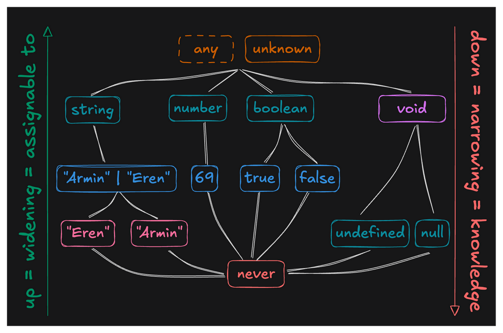

# Type Hierarchy

All types in TypeScript can be arranged into a hierarchy. Understanding this hierarchy is fundamental to mastering type narrowing and type safety.



## Understanding the Hierarchy

The diagram above illustrates how TypeScript types are organized:

- **Top of the hierarchy (widest)** - Types like `any` and `unknown` encompass the most possible values. Very little is known about them.
- **Middle levels** - Primitive types (`string`, `number`, `boolean`) and special types like `void`, followed by unions and literal values.
- **Bottom of the hierarchy (narrowest)** - Specific literal types (`"Armin"`, `69`, `true`) and finally `never`, which represents values that can't occur.

### Assignability Direction

The arrows in the diagram show that **assignability flows upward**:
- Types lower in the hierarchy are assignable to types above them
- Types higher in the hierarchy are **not** assignable to types below them

## Key Types in the Hierarchy

### Top Types

- **`any`** (shown with dashed border) - The exceptional type that breaks all type safety rules. It allows you to do whatever you want, effectively opting out of type checking.
- **`unknown`** - The safe alternative to `any`. It's at the top but requires type narrowing before use.

### Primitive Types

- **`string`** - All string values, including literal strings like `"Armin"` or `"Eren"`
- **`number`** - All numeric values, including specific numbers like `69`
- **`boolean`** - Includes both `true` and `false` literal values
- **`void`** - Represents the absence of a value (typically for functions that don't return)

### Literal Types

Literal types represent specific, exact values:
- String literals: `"Armin"`, `"Eren"`
- Number literals: `69`
- Boolean literals: `true`, `false`

### Union Types

Types like `"Armin" | "Eren"` sit between their constituent literals and their primitive type.

### Special Types

- **`undefined`** and **`null`** - Specific types that are assignable to `void` (when `strictNullChecks` is disabled)
- **`never`** - At the very bottom, representing values that can't occur

## Assignability Rules

Following the diagram, types can be assigned **upward** (from narrower to wider) but **not downward**:

### Example: String Hierarchy

```typescript
// Following the path from bottom to top
const literal: "Armin" = "Armin";
const union: "Armin" | "Eren" = literal; // ✅ "Armin" → "Armin" | "Eren"
const str: string = union;                // ✅ "Armin" | "Eren" → string
const anything: unknown = str;            // ✅ string → unknown

// Cannot go downward
const notAllowed: "Armin" = union;
// ❌ Error: Type '"Armin" | "Eren"' is not assignable to type '"Armin"'
// What if the value happened to be "Eren"?
```

### Example: Number and Boolean Hierarchies

```typescript
// Number literals flow up to number
const specificNumber: 69 = 69;
const anyNumber: number = specificNumber; // ✅ 69 → number

// Boolean literals flow up to boolean
const t: true = true;
const b: boolean = t;                     // ✅ true → boolean
```

### Special Cases: `void`, `undefined`, and `null`

When `strictNullChecks` is disabled:
- `undefined` and `null` are assignable to `void`
- `void` is **not** assignable to `undefined` or `null`

```typescript
// With strictNullChecks: false
function returnsVoid(): void {
  return undefined; // ✅ Valid
}

const undef: undefined = returnsVoid(); // ❌ Invalid
```

## Why This Matters

Understanding the type hierarchy helps you:

1. **Predict type errors** - You'll know when assignments will fail
2. **Write safer code** - Choose the right type specificity for your needs
3. **Master type narrowing** - Move from wider types to narrower, more specific types
4. **Avoid `any`** - Use `unknown` when you need a top type but want type safety

## The `never` Type: Everything Flows to Nothing

As shown at the bottom of the diagram, all types are assignable to `never`, but `never` isn't assignable to anything (except itself). This makes sense because `never` represents values that can't exist:

```typescript
function throwError(): never {
  throw new Error("This never returns");
}

// All types can be assigned to never (theoretically)
// but you'll never actually have a never value to assign
const n: never = throwError(); // Function never returns
```